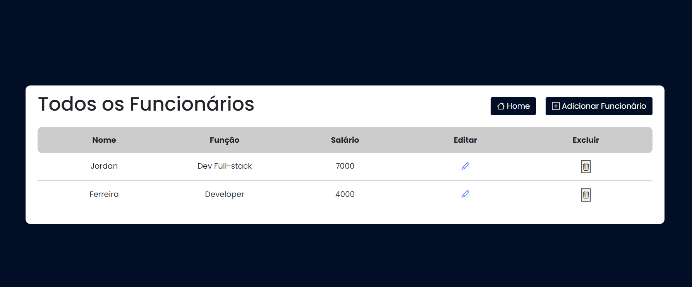

<h1 align="center" id="title">Cadastro de Funcionários</h1>

## Índice

- [Visão geral](#visão-geral)
  - [Screenshot](#screenshot)
  - [Links](#links)
- [Meu processo](#meu-processo)
  - [Tecnologias](#tecnologias)
  - [Recursos úteis](#recursos-úteis)
- [Requisitos](#requisitos)
  - [Rodando o projeto](#rodando-o-projeto)
- [Autor](#autor)


## Visão geral
Um sistema simples para cadastro de funcionários.

### Screenshot
Home

Users


### Links
- URL: ⚠️


## Meu processo

### Tecnologias
- [Node.js](https://nodejs.org/en/)
- [JavaScript](https://developer.mozilla.org/pt-BR/docs/Web/JavaScript)
- [HTML](https://developer.mozilla.org/pt-BR/docs/Web/HTML)
- [CSS](https://developer.mozilla.org/pt-BR/docs/Web/CSS)
- [Handlebars](https://handlebarsjs.com/)
- [Sequelize](https://sequelize.org/)

###  Recursos úteis
- [ video do sujeito programador ](https://youtu.be/cFaihdXLy5A)
- [ website w3schools ](https://www.w3schools.com/)


## Requisitos

Para rodar na sua máquina, você vai precisar ter instalado as seguintes ferramentas: [Git](https://git-scm.com), [Node](https://nodejs.org/en/) e [MySQL](https://www.mysql.com/) (ou outro sistema de gerenciamento de BD que dê para utilizar o sequelize).

### Rodando o projeto

```bash
# Clone este repositório
$ git clone https://github.com/jordanferreiraa/crud-funcionarios

# Acesse a pasta do projeto
$ cd crud-funcionarios

# Instale as dependências
$ npm install

# Crie um schema no seu banco de dados
# Acesse o arquivo db/conn.js e informe os dados do seu banco de dados.

# Execute a aplicação em modo de desenvolvimento
$ node index.js

# O servidor iniciará na porta:5173 <http://localhost:3000/users>

# NÃO ESQUEÇA DO: /users
```

## Autor

- Linkedin - [ @jordan-ferreira-sousa ](https://www.linkedin.com/in/jordan-ferreira-sousa/)
- Instagram - [ @jordanferreirae ](https://www.instagram.com/jordanferreirae)

&#xa0;

<a href="#title">Back to top</a>